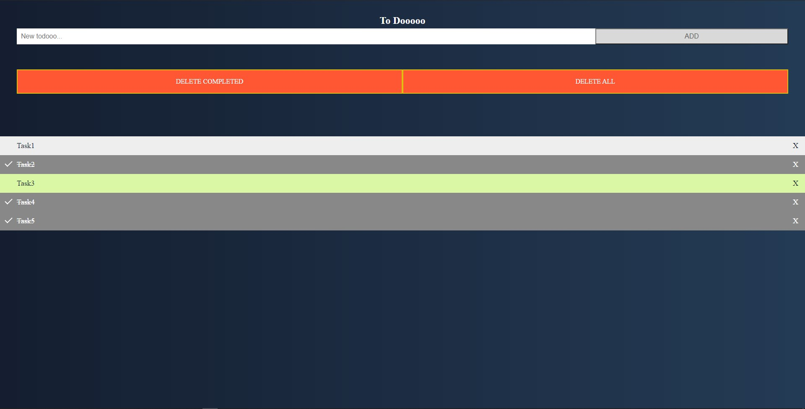

# simpleTodoApp

This is very simple todo app. It uses mongoDB. I developed it to learn mongoDB connection with flask.




---
## Installation
> Installation requires Python3 and Virtualenv
```bash
~$ git clone https://github.com/aesavas/simpleTodoApp.git and cd simpleTodoApp
~$ python -m virtualenv venv
~$ source venv/Scripts/activate
~$ pip install -r requirements.txt
~$ env FLASK_APP=main.py
~$ env FLASK_ENV=1
~$ flask run
```

Please visit the address with a web browser.

> Project URL (/localhost:5000): http://127.0.0.1:5000/

## Used Technologies

* [flask] - Micro web framework
* [pymongo] - The PyMongo distribution contains tools for interacting with MongoDB database from Python. The bson package is an implementation of the BSON format for Python. The pymongo package is a native Python driver for MongoDB. The gridfs package is a gridfs implementation on top of pymongo.
* [dnspython] - dnspython provides both high and low level access to DNS. The high level classes perform queries for data of a given name, type, and class, and return an answer set. The low level classes allow direct manipulation of DNS zones, messages, names, and records. (I need this package for mongodb connection. I got some errors and found this package as a solution.)


[flask]: <http://flask.pocoo.org>
[pymongo]: <https://pypi.org/project/pymongo/>
[dnspython]: <https://pypi.org/project/dnspython/>
